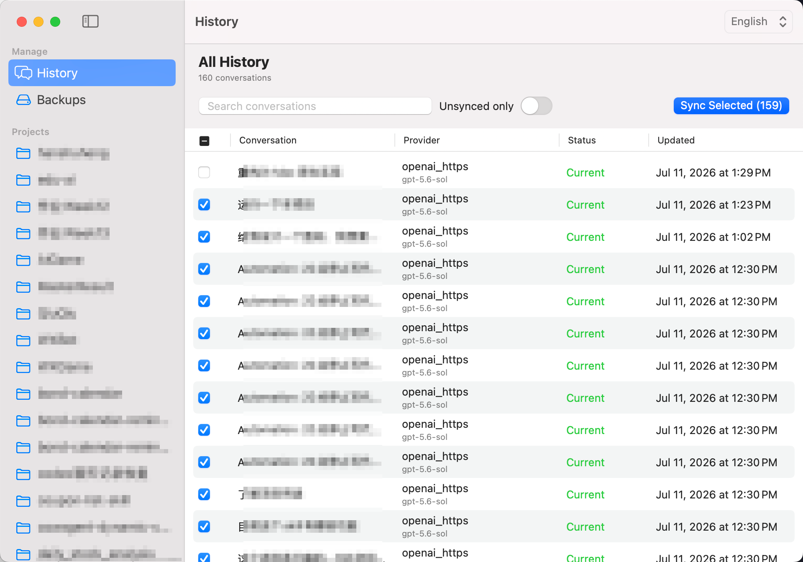
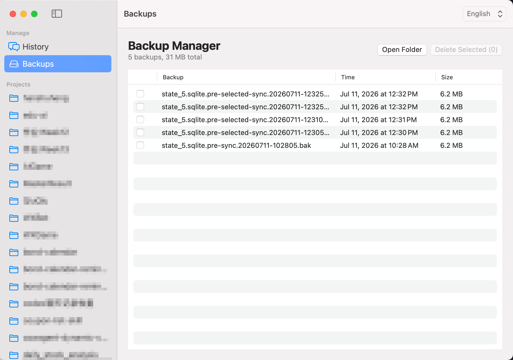

# Codex History Sync Tool

[简体中文](README.zh-CN.md) · English

<p align="center">
  
</p>

A native macOS, backup-first utility for making Codex Desktop conversations visible again after switching accounts, providers, models, or login methods.

> This tool changes local Codex metadata only. It does not upload conversations, sync between devices, or recover deleted files.

## Features

- Native macOS SwiftUI app for browsing and syncing selected conversations
- Standard macOS sidebar-detail layout with labeled page actions, searchable history, keyboard-friendly selection, and clear empty states
- Fully native local services powered by Foundation and system SQLite
- Syncs provider/model metadata, session metadata, and the sidebar index
- Excludes archived conversations from listing and synchronization
- Switches between English and Simplified Chinese at runtime; localization resources are ready for more languages
- Displays all user-facing timestamps as `yyyy-MM-dd HH:mm:ss`
- Creates a complete backup before every sync
- Manages backup bundles without third-party dependencies
- Optional local Codex account pool for login, usage refresh, warmup, and direct account switching

## Screenshots

### History



### Backup Manager



## Download and Use

1. Download `CodexHistorySync.dmg` from [GitHub Releases](https://github.com/HanShuheng/codex-history-sync-tool/releases), version `v0.1.4`.
2. Open the disk image and move `CodexHistorySync.app` to `Applications`.
3. Quit or pause active Codex tasks before changing history metadata.
4. Open the app, select the conversations you want, and click **Sync Selected**.
5. Restart Codex Desktop if its sidebar does not refresh immediately.

The release is a self-contained universal app for Apple Silicon and Intel Macs running macOS 13 or later. Python and Xcode are not required to use the compiled app.

> If a build has not been signed and notarized with an Apple Developer ID, macOS may block the first launch. Right-click the app and choose **Open** only when you obtained it from a source you trust. Public releases should be signed and notarized by the distributor.

## Build from Source

Requirements: macOS 13+ and Xcode Command Line Tools.

```bash
git clone https://github.com/HanShuheng/codex-history-sync-tool.git
cd codex-history-sync-tool
./script/build_and_run.sh
```

The app is built locally at `dist/CodexHistorySync.app`. Archived conversations are intentionally hidden and never changed.

### Build a distributable app

```bash
./script/package_release.sh
```

This creates a universal Apple Silicon and Intel app at `dist/CodexHistorySync.app` and packages it as `dist/CodexHistorySync.dmg`. Upload the DMG as a GitHub Release asset. Public distribution requires Apple Developer ID signing and notarization:

```bash
SIGNING_IDENTITY="Developer ID Application: Your Name (TEAMID)" \
NOTARY_PROFILE="notary-profile" \
./script/package_release.sh
```

## How It Works

Codex Desktop stores local thread metadata under `~/.codex`. After an account or provider change, old data may still exist while no longer matching the active configuration. This tool:

1. Reads the active provider/model from `config.toml`.
2. Finds non-archived mismatched threads in `state_5.sqlite` and session files.
3. Creates a SQLite-consistent database backup plus sidebar/session metadata snapshots.
4. Updates only the selected scope and rebuilds the visible sidebar index.

Backups are stored in `~/.codexhistorysync/history_sync_backups`.

## Data Safety

- Pause active Codex responses before syncing history.
- Keep the automatically created backup until you have confirmed that Codex displays the expected conversations.
- Never publish your `~/.codex` directory, database, sessions, configuration, or backups.
- If the sidebar does not refresh immediately, restart Codex Desktop.
- Conversations may still be grouped by their original project directory (`cwd`). This tool does not rewrite project ownership.

## Legal and Responsibility Notice

This project is provided solely for learning, research, and personal local-data maintenance. It is an independent community project and is not affiliated with, endorsed by, or supported by OpenAI or Codex.

The software directly modifies local Codex metadata. Before using it, you are responsible for backing up your data, verifying that your use complies with applicable laws, platform terms, workplace policies, and third-party rights, and confirming that you are authorized to operate on the relevant device and data. Do not use it to access, alter, disclose, or distribute data without authorization.

The software is provided **“as is”**, without warranties of any kind. To the maximum extent permitted by applicable law, the authors and contributors are not liable for data loss, account issues, service interruption, device damage, compliance failures, disputes, or other direct or indirect losses arising from use or misuse of the software. You assume the risks and consequences of using it. This notice does not exclude liability that cannot legally be excluded. See the [MIT License](LICENSE) for the governing license terms.

## Development

```bash
./script/test_native_backend.sh
./script/test_account_pool.sh
swift build
./script/build_and_run.sh --verify
```

The run script also supports `--debug`, `--logs`, and `--telemetry`. SwiftPM first stages a real `.app` bundle and launches it through macOS `open`; `--verify` checks that the app process is running.

The project uses only the Swift standard library, Foundation, SwiftUI, and system SQLite. The app entrypoint, views, models, stores, services, support code, and resources are kept in separate directories. See [CONTRIBUTING.md](CONTRIBUTING.md) and [SECURITY.md](SECURITY.md).

Swift sources follow `App`, `Views`, `Models`, `Stores`, `Services`, `Support`, and `Resources` boundaries. To add a language, add `Resources/<language>.lproj/Localizable.strings` and register it in `AppLanguage`.

## License

[MIT License](LICENSE). By using, copying, modifying, or distributing this project, you agree to follow its license terms and accept the responsibility notice above.
