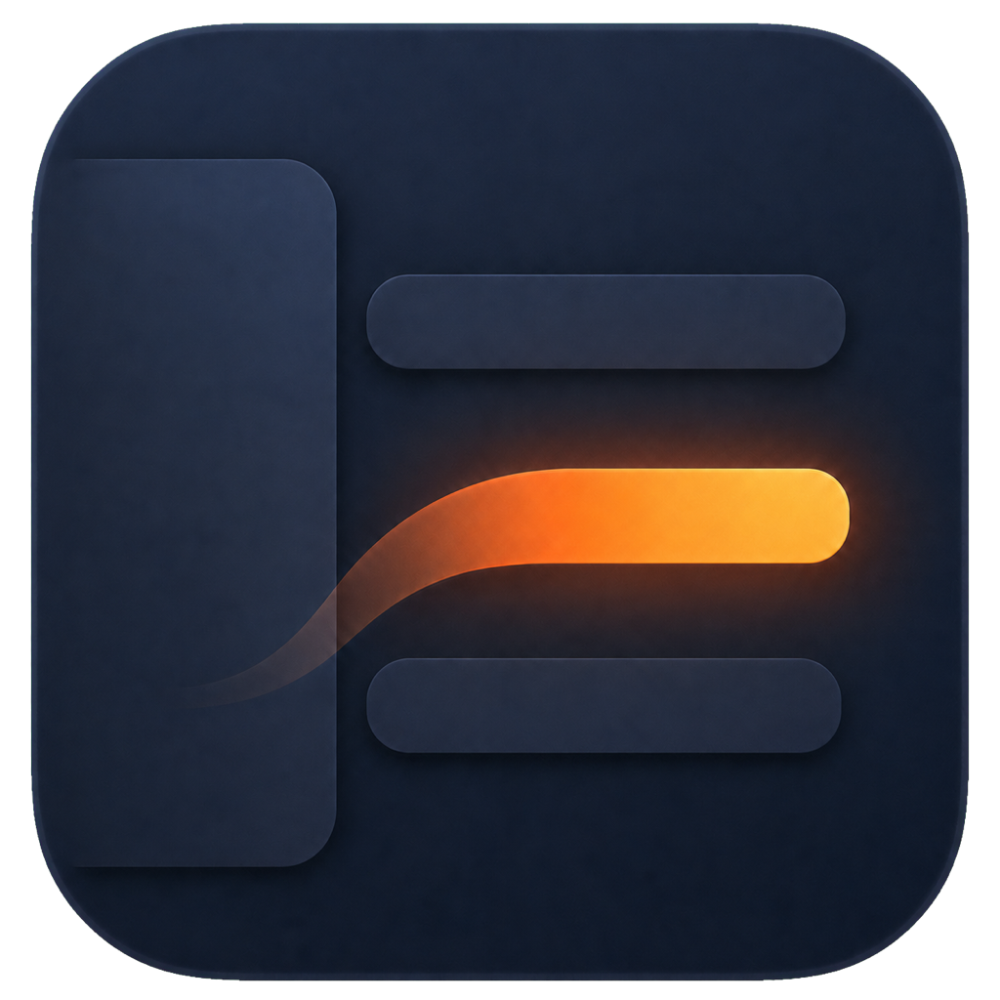
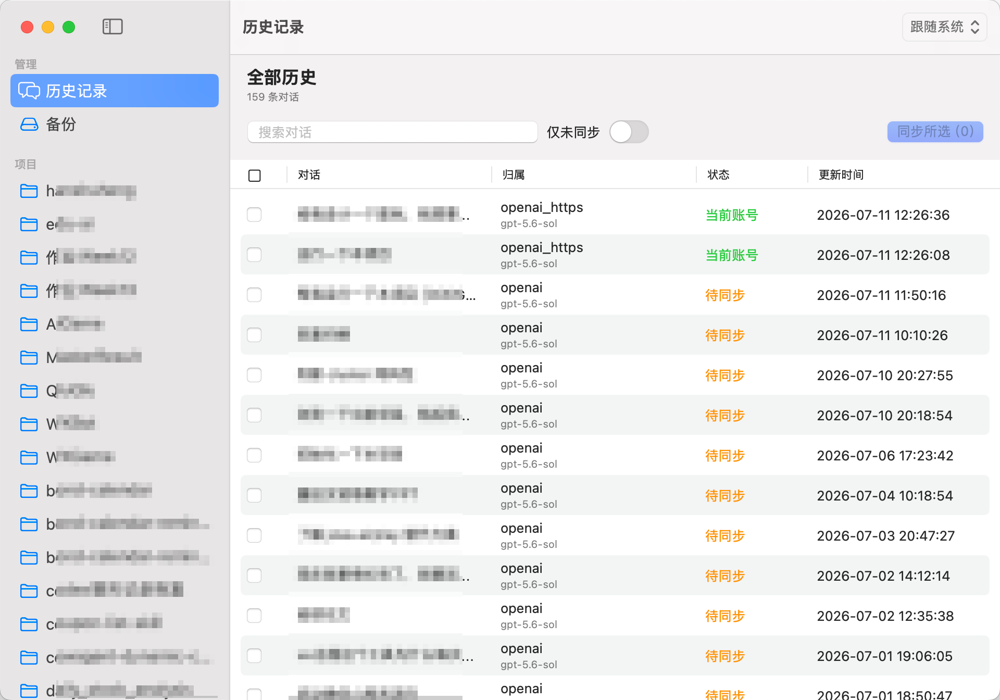
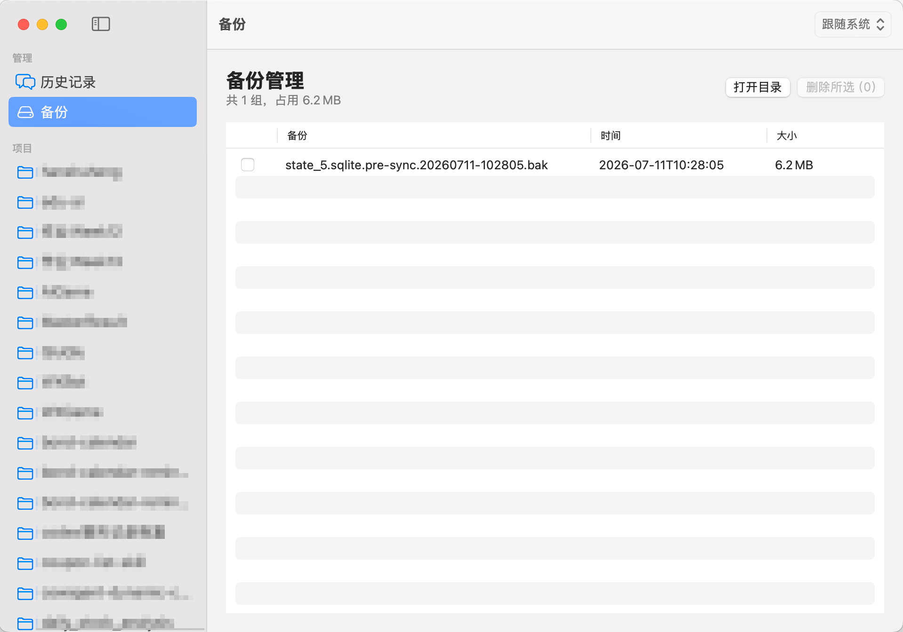

# Codex 历史同步工具

简体中文 · [English](README.md)

<p align="center">
  
</p>

一个原生 macOS、备份优先的小工具，用于让因切换账号、Provider、模型或登录方式而在 Codex Desktop 侧边栏中消失的历史对话重新可见。

> 本工具只修改本机 Codex 元数据，不会上传对话、跨设备同步，也无法恢复已经删除的文件。

## 功能

- 原生 macOS SwiftUI 应用，可按项目浏览并选择性同步历史
- Foundation 与系统 SQLite 驱动的全原生本地服务
- 同步数据库、会话元数据和侧边栏索引中的 Provider/模型归属
- 归档对话不展示、不参与同步
- 支持在应用内切换简体中文与英文，并预留其他语言扩展入口
- 每次同步前自动创建完整备份
- 可管理成组备份，无第三方依赖

## 应用截图

### 历史记录



### 备份管理



## 下载并使用

1. 从项目发布页面下载 `CodexHistorySync.zip`。
2. 解压后将 `CodexHistorySync.app` 移入“应用程序”目录。
3. 修改历史元数据前，先暂停或结束正在运行的 Codex 任务。
4. 打开应用，勾选需要恢复显示的对话，然后点击“同步所选”。
5. 如果侧边栏没有立即刷新，请重启 Codex Desktop。

发布包是自包含的通用应用，支持 macOS 13 及以上版本的 Apple Silicon 和 Intel Mac。使用编译好的应用不需要安装 Python 或 Xcode。

> 如果发布包未使用 Apple Developer ID 签名并完成公证，macOS 可能阻止首次启动。仅在确认下载来源可信时，右键应用并选择“打开”。公开发布者应对正式版本完成签名和公证。

## 从源码构建

要求：macOS 13+、Xcode Command Line Tools。

```bash
git clone https://github.com/HanShuheng/codex-history-sync-tool.git
cd codex-history-sync-tool
./script/build_and_run.sh
```

应用会构建到 `dist/CodexHistorySync.app`。归档对话会被隐藏且不会被修改。

### 构建分发包

```bash
./script/package_release.sh
```

脚本会生成同时支持 Apple Silicon 和 Intel Mac 的 `dist/CodexHistorySync.app` 与 `dist/CodexHistorySync.zip`。公开分发时需要 Apple Developer ID 签名和公证：

```bash
SIGNING_IDENTITY="Developer ID Application: 你的名称 (TEAMID)" \
NOTARY_PROFILE="notary-profile" \
./script/package_release.sh
```

## 工作原理

Codex Desktop 把本地线程元数据保存在 `~/.codex`。切换账号或 Provider 后，旧数据可能仍在磁盘上，但归属与当前配置不一致。本工具会：

1. 从 `config.toml` 读取当前 Provider 和模型。
2. 在 `state_5.sqlite` 与会话文件中找出未归档且归属不一致的线程。
3. 使用 SQLite Backup API 备份数据库，并保存侧边栏索引与会话首行元数据。
4. 只修改选定范围，然后重建可见侧边栏索引。

备份默认保存在 `~/.codex/history_sync_backups`。

## 数据安全

- 同步历史前，请先暂停正在生成回复的 Codex 任务。
- 确认 Codex 已正确显示预期对话前，请保留应用自动创建的备份。
- 不要公开上传 `~/.codex`、数据库、会话记录、配置或备份。
- 如果侧边栏没有立即刷新，请重启 Codex Desktop。
- Codex 可能仍按原项目目录（`cwd`）分组历史；本工具不会批量改写项目归属。

## 法律与责任声明

本项目仅供学习、研究和个人本地数据维护使用，是独立的社区项目，与 OpenAI 或 Codex 不存在隶属、授权、认可或官方支持关系。

本软件会直接修改本机 Codex 元数据。使用前，使用者有责任自行备份数据，确认相关操作符合适用法律法规、平台条款、所在组织的管理制度及第三方权利要求，并确保自己有权操作相关设备和数据。严禁将本软件用于未经授权的数据访问、修改、披露或传播。

本软件按**“现状”**提供，不作任何明示或默示保证。在适用法律允许的最大范围内，作者及贡献者不对因使用或误用本软件造成的数据丢失、账号问题、服务中断、设备损坏、合规风险、争议或其他直接、间接损失承担责任。使用者应自行判断并承担使用风险及后果。本声明不排除依法不得排除的责任，具体许可条件以 [MIT 许可证](LICENSE)为准。

## 开发

```bash
./script/test_native_backend.sh
swift build
./script/build_and_run.sh --verify
```

项目只使用 Swift 标准库、Foundation、SwiftUI 与系统 SQLite。贡献与安全报告方式见 [CONTRIBUTING.md](CONTRIBUTING.md) 和 [SECURITY.md](SECURITY.md)。

Swift 源码按 `App`、`Views`、`Models`、`Stores`、`Services`、`Support` 和 `Resources` 分层。新增语言时，只需添加 `Resources/<语言>.lproj/Localizable.strings` 并在 `AppLanguage` 中注册。

## 许可证

[MIT 许可证](LICENSE)。使用、复制、修改或分发本项目即表示你同意遵守许可证条款，并知悉上述责任声明。
